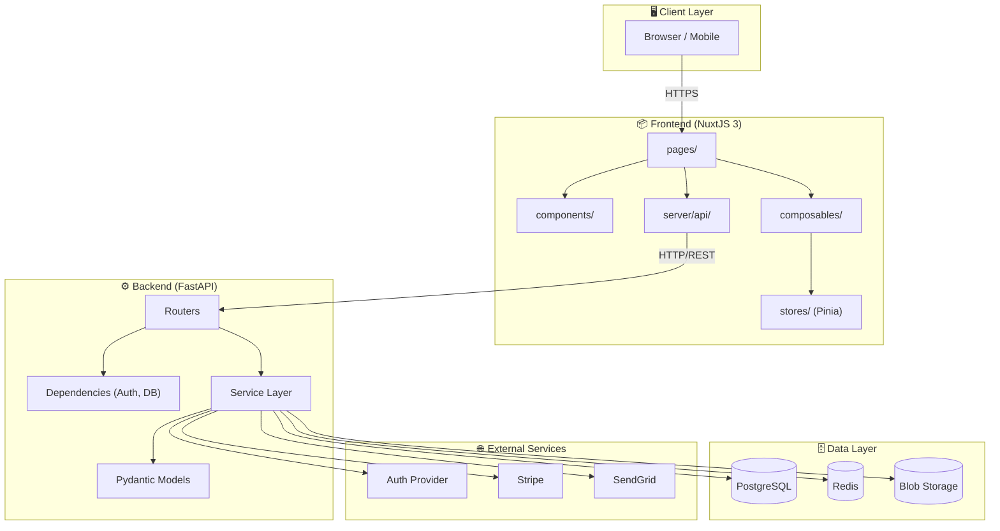
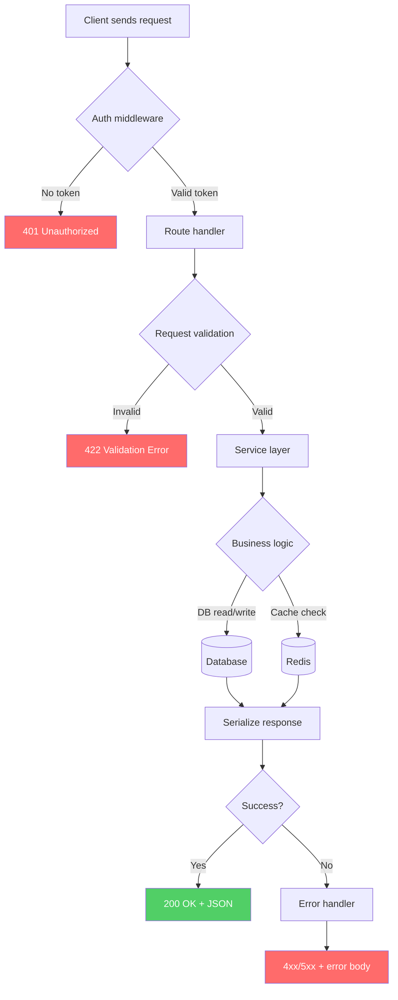
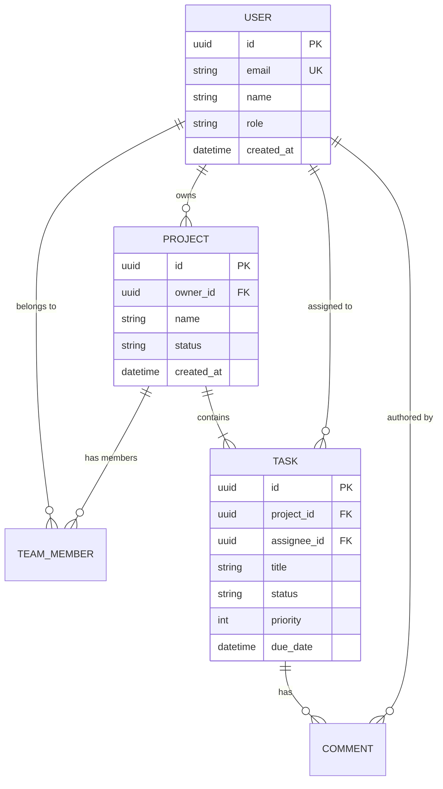
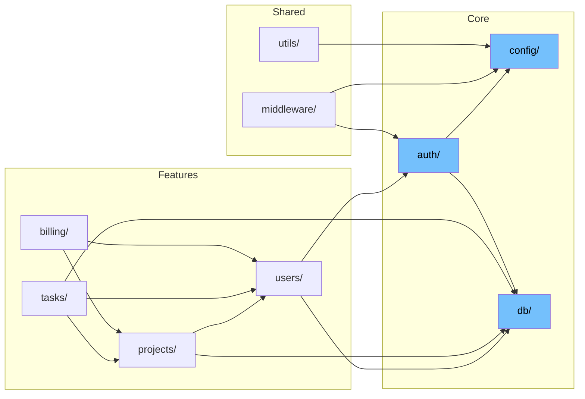
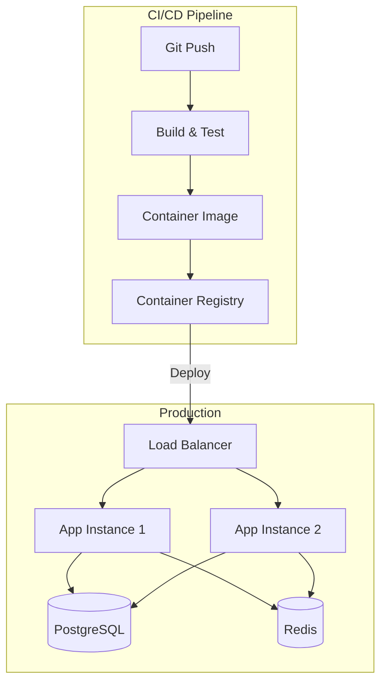
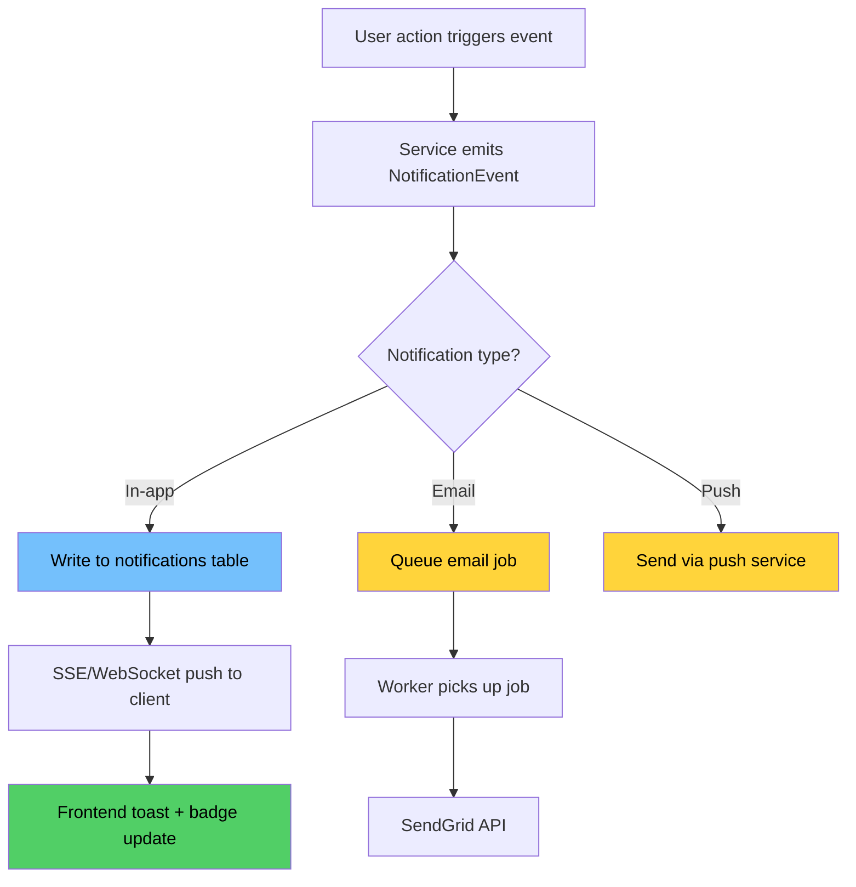

# Codebase Review — Reference

## Mermaid diagram templates

Use these as starting points. Adapt to the actual codebase — never force a template onto a codebase that doesn't fit.

---

### Architecture diagram

---

### Request lifecycle flowchart

---

### Data model (ER diagram)

---

### Module dependency graph

---

### Deployment / infra diagram

---

### Feature implementation flowchart (example: "Add notifications")

---

## Health assessment rubric

| Area | Green | Yellow | Red |
|------|-------|--------|-----|
| **Test coverage** | Unit + integration tests, CI runs them | Some tests exist, not comprehensive | No tests or tests are all skipped/broken |
| **Error handling** | Centralized handler, typed errors, logging | Mix of try/catch and unhandled | Errors swallowed, no logging, crashes leak stack traces |
| **Code organization** | Consistent pattern, clear boundaries | Mostly consistent with a few outliers | No discernible pattern, god files, circular deps |
| **Security** | Secrets in env, auth middleware, CORS locked, input validated | Most secrets in env, auth exists but gaps | Hardcoded secrets, no auth on some routes, wide-open CORS |
| **Documentation** | README + inline docs on complex logic | README exists, sparse inline docs | No docs, misleading comments |
| **Dependencies** | Up to date, no known CVEs, minimal | Slightly behind, 1–2 advisories | Major versions behind, known vulnerabilities, bloated |

## Stack-specific reconnaissance hints

### NuxtJS / Vue
- Check `nuxt.config.ts` for modules, plugins, runtime config
- Scan `pages/` for route structure (file-based routing)
- Look at `composables/` and `stores/` for state management pattern
- Check `server/api/` for Nitro server routes
- Look for `middleware/` (route guards, auth)
- Check `.env` / `runtimeConfig` for environment handling

### FastAPI / Python
- Check `main.py` or `app.py` for app factory and router inclusion
- Scan `routers/` or `api/` for endpoint definitions
- Look at `models/` for SQLAlchemy/Pydantic models
- Check `dependencies.py` or `deps/` for DI pattern
- Look for `alembic/` for migration strategy
- Check `requirements.txt` / `pyproject.toml` for dependency versions

### .NET
- Check `Program.cs` for service registration and middleware pipeline
- Scan `Controllers/` for API surface
- Look at `Models/` or `Entities/` for EF Core models
- Check `Services/` for business logic layer
- Look for `Migrations/` for EF migration history
- Check `appsettings.json` for config structure

### General
- `docker-compose.yml` — what services exist, what ports, what volumes
- `.github/workflows/` or `azure-pipelines.yml` — CI/CD stages
- `.env.example` — what environment variables are expected
- `README.md` — does it exist? Is it accurate?
